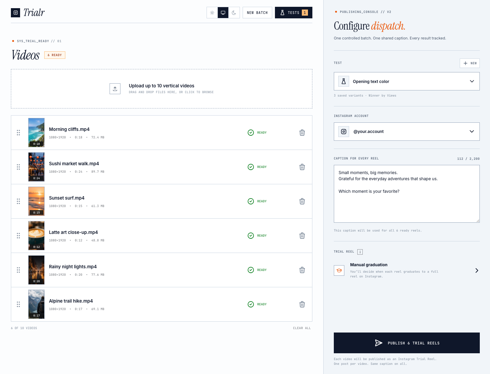

# Trialr

Trialr is a local app for publishing multiple videos as separate Instagram Trial Reels through [Zernio](https://zernio.com). Add up to ten vertical videos, write one caption, and Trialr publishes one Reel per video with manual graduation enabled.

It also groups published Reels into tests so you can refresh analytics, compare variants, and identify the current leader.



## What it includes

- Batch publishing for up to 10 MP4 or MOV videos
- One shared caption for the entire batch
- Instagram Trial Reels with manual graduation
- Drag-and-drop ordering and editable variant names
- 9:16 video previews and a playback lightbox
- Reusable tests with hypotheses and primary metrics
- Zernio and Instagram post tracking
- Manual analytics refresh with recent snapshots
- Light, System, and Dark appearance modes
- Local JSON persistence with no database required

## Requirements

- macOS, Windows, or Linux
- [Node.js 20 or newer](https://nodejs.org/)
- A free [Zernio account](https://zernio.com)
- An Instagram Business or Creator account. Personal accounts cannot publish through Instagram's API.
- Codex Desktop, Claude Code, or a terminal

## Fastest setup with Codex Desktop or Claude Code

1. Download this repository as a ZIP and extract it, or clone it with Git.
2. Open the extracted `trialr` folder in Codex Desktop or Claude Code.
3. Paste the prompt below into the coding agent.

```text
Initialize this Trialr project for local use. Read README.md and AGENTS.md first. Verify that Node.js 20 or newer and npm are available. Run npm install. If .env does not exist, create it from .env.example. Pause and tell me to add my ZERNIO_API_KEY directly to .env myself. Do not ask me to paste the key into chat and never display it back to me. After I confirm it is saved, run npm test and npm run build. Start npm run dev, open or give me the local app URL, and help me connect my Instagram account. Do not publish any Reel during setup or testing.
```

The agent should install the dependencies, prepare the environment file, validate the project, and start the local app.

## Zernio setup

1. [Create or sign in to a Zernio account](https://zernio.com).
2. In Zernio, open **Settings → API Keys**.
3. Select **Create API Key** and create a read-write key for Trialr.
4. Copy the key immediately. Zernio only shows the complete key once.
5. In the Trialr folder, copy `.env.example` to a new file named `.env`.
6. Add the key:

```dotenv
ZERNIO_API_KEY=your_zernio_api_key_here
PORT=4173
```

7. Restart Trialr after changing `.env`.
8. Open Trialr and select **Connect Instagram**. Complete Zernio's hosted Instagram authorization flow.

Zernio's current API quickstart is available at [docs.zernio.com](https://docs.zernio.com/). Its [Instagram guide](https://docs.zernio.com/platforms/instagram) covers supported account types, formats, limits, and OAuth permissions.

## Manual installation

```bash
npm install
cp .env.example .env
npm test
npm run dev
```

Add your Zernio key to `.env`, restart the development server, and open the local URL printed in the terminal.

For a production-style local run:

```bash
npm run build
npm start
```

Then open `http://localhost:4173`.

## Using Trialr

1. Connect or select your Instagram account.
2. Create a test and choose the metric you want to optimize.
3. Upload up to ten vertical videos.
4. Click a filename to give each variation a useful label.
5. Add one caption for the batch.
6. Review the queue, then publish.
7. Open **Tests** and select **Refresh stats** as the Reels collect data.

Publishing is real. Clicking the publish button sends each ready video to the selected Instagram account immediately. Trialr does not publish anything automatically when the app starts.

## Video requirements

- MP4 or MOV
- 9:16 vertical format
- 3 to 90 seconds
- Maximum 300 MB per file
- Maximum 10 videos per batch
- Captions up to 2,200 characters

## Password protection and hosting

Trialr runs unlocked on your own machine by default. To require a password, add one to `.env` and restart:

```dotenv
TRIALR_PASSWORD=choose_a_long_passphrase
```

Every page and API request then requires signing in once per browser (the session lasts 30 days).

When Trialr detects it is running on Railway, the password becomes mandatory: without `TRIALR_PASSWORD` the API locks itself instead of running open to the internet. A hosted deployment needs three things: the `ZERNIO_API_KEY` and `TRIALR_PASSWORD` environment variables, and a persistent volume mounted at `data/` so experiment history survives redeploys.

## Local data and privacy

- Your Zernio API key stays in the local Node server and is never sent to the browser.
- Test history is stored in `data/experiments.json`.
- `.env` and `data/experiments.json` are excluded from Git.
- Uploaded videos are sent to Zernio so Zernio can publish them to Instagram.
- Turning the local server off does not erase saved tests.

The local JSON file is not a cloud backup. Copy it somewhere safe if the experiment history matters. Moving to another computer requires copying that file too.

## Demo mode

Open `http://localhost:5173/?demo=1` while the development server is running to inspect the interface with fictional accounts, videos, tests, and analytics. Demo mode cannot publish.

## Troubleshooting

### Failed to fetch accounts

- Confirm the app is running through `npm run dev` or `npm start`. Do not open `index.html` directly.
- Confirm `.env` exists and contains `ZERNIO_API_KEY`.
- Restart the server after changing `.env`.
- Confirm the Instagram account is Business or Creator and completed Zernio authorization.

### Analytics are blank or delayed

Instagram analytics may take time to appear. Refresh the test later. Some metrics can be unavailable or return zero depending on the post and Instagram's current reporting.

### Port already in use

Stop the other local server, or change `PORT` in `.env` before running `npm start`.

## Security

Never paste an API key into source code, a GitHub issue, a screenshot, or a chat message. Keep it only in `.env`. If a key is exposed, revoke it in Zernio and create a new one.

## License

[MIT](LICENSE)

Trialr is an independent project and is not affiliated with Instagram, Meta, or Zernio.
